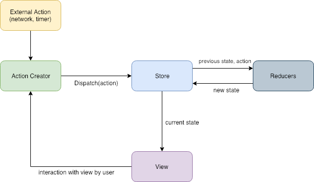

# RadioDns Demonstrator Architecture

## A quick recap on React Native
React native is a game changer as it allows us to create rapidly interfaces based on web technologies
rather than working with a native SDK. The strength of this is that React Native does not rely on
webviews like Phonegap, ionic or cordova. It provides instead bidings to use native views, components
and specific device APIs. So when one is writing React Native apps, one builds native UIs.

So bear in mind that even if we are working with TypeScript and JavaScript, under the hood it is 
native mobile that is running:
- One should always test its components on all mobile operating system to
ensure that they are rendered correctly on each one.
- One should always be careful of excessive CPU usage and memory management.
- One should always remember to cancel any asynchronous task when dismounting a react component.
- Upon retrieving data from network one should always implement a caching system for this data as network
queries are an expensive task in terms of battery. 

## Application data flow
### Flux pattern
In order to understand the Redux pattern let us start with the Flux pattern first.
It was introduced by Facebook a few years ago and consists of an unidirectional data flow.

There is 4 main components to the Flux pattern:
1. Actions
2. Dispatcher
3. Stores
4. Views

When a user interacts with a view, it propagates an action to a central dispatcher. The dispatched is responsible to
propagate actions to one/many store objects.

A store object hold the application state, data and business logic. They must respond to an action being dispatched to 
them and are also responsible to update the views that are affected by specification that indicates that data/state has changed.

A view holds the responsibility to update accordingly to new data/sate, interact with users and fire actions into the
dispatcher.

Note that not only views can fire actions. Results from ajax calls or timer should also be capable of firing actions into
the dispatcher.

### Redux pattern
You can think of Redux as an extension of Flux.

Redux adds 3 new major principles:
1. Single source of truth
2. State is read-only
3. Changes are made with pure functions.

#### Single source of truth
Redux patterns enforces having only a single store per app. One store to contain all the application data and state.

Flux described multiple stores each one being specific to a topic but this pattern can induce some complexity as one may
have to wait for an other store to update.

#### State is read-only
Because views and network callbacks can never write directly into the state but rather have to express an intent to do so,
we get a centralized way of handling updates, each happening one by one in a strict order. So this solve problems like 
race conditions!

#### Changes are made with pure functions
In order to express how state transition occurs, the Redux pattern uses functions called "reducer". All theses reducers are pure functions.
A pure function is a function that produces output without changing its inputs. A reducer get the old state and computes a
new one.

#### Data flow
Redux data flow is based on Flux's one but with some changes:

As you can see we no longer have a central dispatcher but instead action creators that dispatch actions to the store.
The store will then use this action and its reducers to compute a new state. The said state will be then delivered to 
views and they will update accordingly.

This data flow enable one source of truth an pure updates so in the end we have a predictable data flow that is easier to
use than the Flux pattern.

Find more about [Redux principles here](https://redux.js.org/introduction/core-concepts)!

For more information about Redux's Flux inspiration [go here](https://redux.js.org/introduction/prior-art#flux).

### A Reducer to control the player

The demonstrator uses redux to control the state of the player. This includes the list of the stations available for the
selected service provider, the currently listened to station, if the stream is paused, loading or in an error state and 
at what volume the media should play. Then every react component related to the stream or the player is updated and dispatch
action from and to this reducer.

Whenever 
